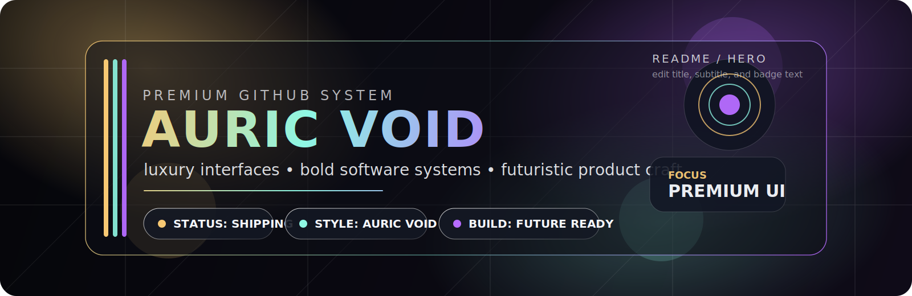

# 

## A statement, not a template

This profile is built around one idea: software should feel **expensive** before a user reads the first line of code.

I build products with strong visual identity, clean architecture, ruthless attention to detail, and a bias toward systems that are both elegant and fast.

---

## Core focus

- Premium UI systems
- AI-native product design
- Frontend architecture with motion and polish
- Backend services with clean contracts
- Performance, reliability, and sharp developer experience

---

## Signature stack

TypeScript · React · Next.js · Node.js · Python · PostgreSQL · Docker · Tailwind · Framer Motion

---

## Selected systems

### AURORA CONSOLE
A high-clarity command center for product analytics, automation, and decision workflows.

**Highlights**
- dense dashboards without visual noise
- dark-mode-first design language
- fast, scalable component structure

### VELOCITY ENGINE
A workflow platform built to reduce manual operational drag and increase execution speed.

**Highlights**
- automation-first architecture
- API-driven integrations
- clean auditability and system control

### PRISM LAYER
A premium design system for interfaces that need to feel precise, memorable, and modern.

**Highlights**
- token-based styling
- reusable interaction patterns
- scalable visual language

---

## Design principles

1. **Luxury comes from restraint.**  
   Strong hierarchy beats decoration.

2. **Clarity is a feature.**  
   Interfaces should reduce ambiguity, not add style debt.

3. **Every surface should feel intentional.**  
   Typography, spacing, motion, and color need the same level of care as architecture.

4. **Speed matters.**  
   Premium without performance is costume jewelry.

---

## GitHub signal

---

## Current direction

- shipping product-grade interfaces
- refining AI workflows
- building branded developer-facing systems
- pushing visual quality without sacrificing speed

---

## Contact

- GitHub: `@YOUR_USERNAME`
- X: `@YOUR_HANDLE`
- Email: `you@domain.com`
- Portfolio: `https://yourdomain.com`

---

## Palette

- Obsidian: `#05060A`
- Molten Gold: `#F7C873`
- Ultraviolet: `#B66BFF`
- Glacial Mint: `#8EF7E3`
- Rose Plasma: `#FF6BAA`
- Frost White: `#F5F7FB`
